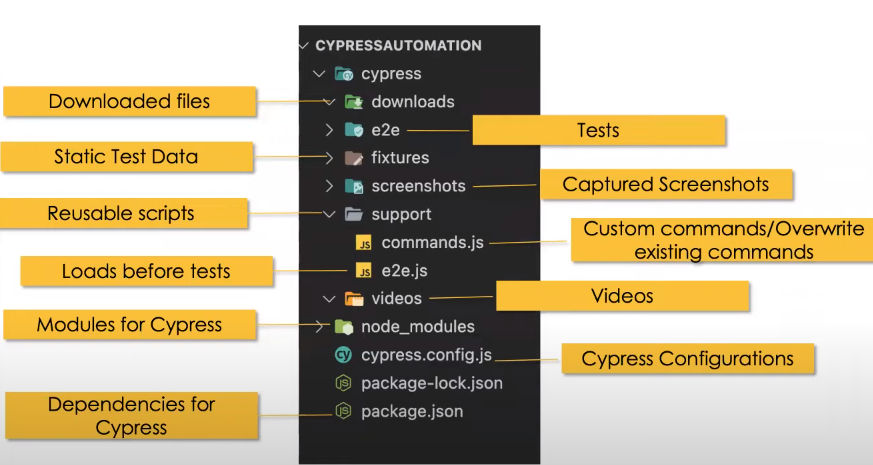

# Cypress E2E Testing (Web and API)

## Topics

Refer to the `cypress/e2e/` folder and navigate to the desired spec file to see the implementation. Each spec file contains the links to official documentation as well as other helpful resources for detailed explaination.

### UI

* Basics
* Locator strategies
* Assertions
* Actions
* Alerts
* New Tab or Windows
* iFrame
* Web Tables
* Mouse Actions
* File upload and download
* Hooks and Tags
* Fixtures
* Data Driven Testing
* Custom Commands
* Navigation
* Screenshots and Videos recording
* Test Reporting
* Page Object Model (POM)
* Reading data from CSV files
* 

### API

* HTTP Requests
* Request Body
* Query Parameters
* Headers and Cookies
* Parsing response
* Schema validation
* XML Resonse Handling
* Authentication
* OAuth 2.0
* API Chaining
* Cypress API Plugin
* Intercepting APIs(Mock and Stub)
* 

## Starting Instructions

* Setup project
`npm init i`
* Install Cypress
`npm intstall cypress --save -dev`
* Open Cypress test runner
`npx cypress open`
* Run cypress tests from terminal
`npx cypress run`
* Run cypress tests from terminal in headed mode
`npx cypress run --headed`
* Run specific test spec
`npx cypress run --spec cypress\e2e\mytest.cy.js`
* Run test on specified browser
`npx cypress run --browser chrome`
* Run test on specified browser in headed mode
`npx cypress run --browser chrome --headed`


## Notes

> Open the cmd from any folder in window by entering cmd in the address bar of windows explorer of particular folder
>
* VS Code settings
To open the Settings editor, navigate to File > Preferences > Settings.

You can also open the Settings editor from the Command Palette (Ctrl+Shift+P) with Preferences: Open Settings or use the keyboard shortcut (Ctrl+,).

* VS Code commenting:
  * Shift + Alt + A multiline comment
  * Ctrl + / single line comment

> Add at the top to enable intellisense. `/// <reference types="Cypress" />` or you can put it in support/commands.js

* If you write custom commands and provide TypeScript definitions for them, you can use the triple slash directives to show IntelliSense, even if your project uses only JavaScript. For example, if your custom commands are written in cypress/support/commands.js and you describe them in cypress/support/index.d.ts use:
  ```
  // type definitions for custom commands like "createDefaultTodos"
  <reference types="../support" />
  ```

* cypress test cases have suffix `.cy.js`

* Cypress supports only chromium based browsers.
* Cypress supports CSSSelectors and XPath with plugin (XPath now deprecated).
* Tag is optional in CSS Selectors.
* Cypress test runner automatically executes test cases on new saved changes.

## Cypress snippets Plugin
https://marketplace.visualstudio.com/items?itemName=CliffSu.cypress-snippets

* You can also locate the element in cypress test runer by clicking on element and then copy the cypress locator.

* Cypress Folder Structure
  


> This inclusive ability is available in Mocha by appending .skip() to the suite or to specific test cases.
> The skipped tests will be marked as “pending” in the test results.
> Another quick option is prepending x to the it or the describe:
> https://danielkorn.io/post/skipping-tests-in-mochajs/

> Or you can only execute as specific test with it.only() 


